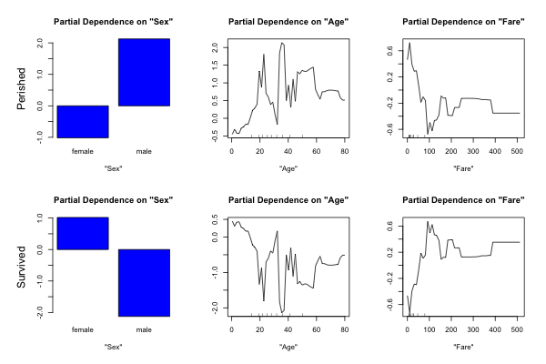

## Random Forest tutorial

#### SAS Machine-learning Cheat Sheet

This tutorial runs Random Forest models using the `randomForest` package. It covers:

1. Simple vs. Complicated Random Forests
2. Covariate response curves  

3. Changes in performance with # of trees or # of variables at splits
4. Variable Importance Plots
5. Confusion Matrices & Performance Metrics
6. Generating ROC curves & AUC values using the `ROCR` package

